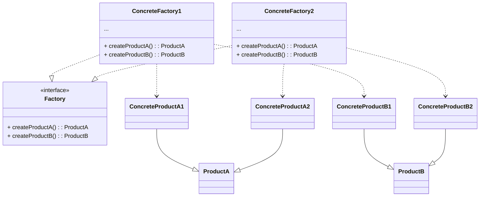
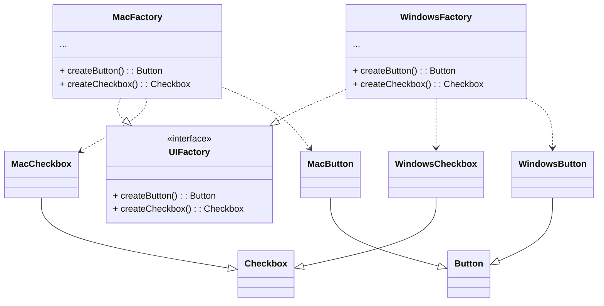

# Abstract Factory

**18125118 Phan Pham Thanh Tuyen**
<footer class="absolute bottom-0 right-0 p-2 text-sm">This slide is powered by <a href="https://sli.dev/">Sli<b>dev</b></a> which will give a better experience if being run on its own server</footer>

---

# Abstract Factory

- Is a creational design pattern
- Provides an interface for creating families of related objects without specifying their concrete classes
- The new operator considered harmful

---

# Problem

- Imagine that we want to create cross-platform UI elements
- It requires that those elements must work the same way under arbitrary operating systems
- Let's say we define a general UI element class that has a pure virtual method called `render()`
- Its concrete UI subclasses override the `render()` method
- In this representation, we consider the `Checkbox` and `Button` classes as UI elements

---
layout: two-cols
---

# Naive Solution

```cpp{all|4-8|10-15|17-22|all}
#include <iostream>
#include <string>
using namespace std;

class Button {
public:
  virtual void render() = 0;
};

class WindowsButton : public Button {
public:
  void render() {
      cout << "WindowsButton is rendered" << endl;
  }
};

class MacButton : public Button {
public:
  void render() {
      cout << "MacButton is rendered" << endl;
  }
};
```

::right::

<div class="mt-14 ml-4">

```cpp{all|1-4|6-11|12-18|all}
class Checkbox {
public:
  virtual void render() = 0;
};

class WindowsCheckbox : public Checkbox {
public:
  void render() {
      cout << "WindowsCheckbox is rendered" << endl;
  }
};

class MacCheckbox : public Checkbox {
public:
  void render() {
      cout << "MacCheckbox is rendered" << endl;
  }
};
```

</div>

---

# Naive Solution

```cpp{all|3|4-10,21-24|all}
int main()
{
  string OS = "WINDOWS";
  if (OS == "WINDOWS") {
    cout << "Render WindowsForm" << endl;
    Button* windowsButton = new WindowsButton();
    windowsButton->render();
    Checkbox* windowsCheckbox = new WindowsCheckbox();
    windowsCheckbox->render();
  }
  else if (OS == 'MAC') {
    cout << "Render MacForm" << endl;
    Button* macButton = new MacButton();
    macButton->render();
    Checkbox* macCheckbox = new MacCheckbox();
    macCheckbox->render();
  }

  return 0;
}

// Render WindowsForm
// WindowsButton is rendered
// WindowsCheckbox is rendered
```

---

# Issue with Naive Solution

- The client needs to know details of each Button's or Checkbox's subclasses
- The client ends up chaining new `else if`(s) to create new buttons or checkboxes for new operating systems
<uil-arrow-right /> Each time a new change is made at the library side, the client would need to make some corresponding changes at its end
- The consistency of the UI elements is not guaranteed

---
layout: two-cols
---

# Abstract Factory Solution

```cpp{all|4-7|9-14|16-21|all}
#include <iostream>
using namespace std;

class Button {
public:
  virtual void render() = 0;
};

class WindowsButton : public Button {
public:
  void render() {
    cout << "WindowsButton is rendered" << endl;
  }
};

class MacButton : public Button {
public:
  void render() {
    cout << "MacButton is rendered" << endl;
  }
};
```

::right::

<div class="mt-14 ml-4">

```cpp{all|1-4|6-11|12-18|all}
class Checkbox {
public:
  virtual void render() = 0;
};

class WindowsCheckbox : public Checkbox {
public:
  void render() {
      cout << "WindowsCheckbox is rendered" << endl;
  }
};

class MacCheckbox : public Checkbox {
public:
  void render() {
      cout << "MacCheckbox is rendered" << endl;
  }
};
```

</div>

---
layout: two-cols
---

# Abstract Factory Solution

```cpp{all|1-5|7-15|17-25|all}
class UIFactory {
public:
  virtual Button* createButton() = 0;
  virtual Checkbox* createCheckbox() = 0;
};

class WindowsFactory : public UIFactory {
public:
  Button* createButton() {
    return new WindowsButton();
  }
  Checkbox* createCheckbox() {
    return new WindowsCheckbox();
  }
};

class MacFactory : public UIFactory {
public:
  Button* createButton() {
    return new MacButton();
  }
  Checkbox* createCheckbox() {
    return new MacCheckbox();
  }
};
```

::right::

<div class="ml-4 mt-14">

```cpp{all|1-4|7,14|8|9|2-3,15-16|all}
void ClientCode(const Factory& factory) {
  factory.createButton()->render();
  factory.createCheckbox()->render();
}

int main() {
  cout << "Render UIWindows";
  Factory* windowsFactory = new WindowsFactory();
  ClientCode(*windowsFactory);
  delete windowsFactory;
  return 0;
}

// Render UIWindows
// WindowsButton is rendered
// WindowsCheckbox is rendered
```

</div>

---

# Discussion

- With this pattern, the client code only needs to interact with these objects via their abstract interfaces and is not dependent on the concrete classes of factories and UI components
- Additionally, this enables the client code to accommodate any future additions of factories or UI components.
- Each time we add a new variety of UI elements to the app, we don't need to change the client code
- Later, if we want to support Linux operating systems, we only need to make a new factory class that and slightly alter the initialization code of the app

---

# General Solution

- List products and its variants
- Define abstract product interfaces for all product types, then make all concrete product classes implement these interfaces
- Declare the abstract factory interface with a set of creation methods for all abstract products
- Implement a set of concrete factory classes, one for each product variant
- Create factory initialization code
- Replace product constructors with calls to the appropriate creation method on the factory object

---

# General Class Diagram



---

# Class Diagram of the Problem



---
layout: two-cols
---

# General Code Example <uil-java-script class="text-yellow-400" />

```ts {all|1-4|6-14|16-24|all}
interface AbstractFactory {
    createProductA(): AbstractProductA;
    createProductB(): AbstractProductB;
}

class ConcreteFactory1 implements AbstractFactory {
    public createProductA(): AbstractProductA {
        return new ConcreteProductA1();
    }

    public createProductB(): AbstractProductB {
        return new ConcreteProductB1();
    }
}

class ConcreteFactory2 implements AbstractFactory {
    public createProductA(): AbstractProductA {
        return new ConcreteProductA2();
    }

    public createProductB(): AbstractProductB {
        return new ConcreteProductB2();
    }
}
```

::right::

<div class="mt-14 ml-4">

```ts {all|1-3|5-9|11-15|all}
interface AbstractProductA {
  someOperationA(): string;
}

class ConcreteProductA1 implements AbstractProductA {
  public someOperationA(): string {
    return 'The result of the product A1.';
  }
}

class ConcreteProductA2 implements AbstractProductA {
  public someOperationA(): string {
    return 'The result of the product A2.';
  }
}
```

</div>

---
layout: two-cols
---

# General Code Example <uil-java-script class="text-yellow-400" />

```ts{all|1-4|5-13|14-22|all}
interface AbstractProductB {
  someOperationB(): string;
  someOperationBonA(productA: AbstractProductA): string;
}
class ConcreteProductB1 implements AbstractProductB {
  public someOperationB(): string {
    return 'The result of the product B1.';
  }
  public someOperationBonA(productA: AbstractProductA): string {
    const result = productA.someOperationA();
    return `The result of the B1 with the (${result})`;
  }
}
class ConcreteProductB2 implements AbstractProductB {
  public someOperationB(): string {
    return 'The result of the product B2.';
  }
  public someOperationBonA(productA: AbstractProductA): string {
    const result = productA.someOperationA();
    return `The result of the B2 with the (${result})`;
  }
}
```

::right::

<div class="mt-14 ml-4">

```ts{all|1-7|all}
function clientCode(factory: AbstractFactory) {
  const productA = factory.createProductA();
  const productB = factory.createProductB();

  console.log(productB.someOperationB());
  console.log(productB.someOperationBonA(productA));
}

console.log('Client: Testing client code with the first factory type...');
clientCode(new ConcreteFactory1());
console.log('');
console.log('Client: Testing the same client code with the second factory type...');
clientCode(new ConcreteFactory2());

// Client: Testing client code with the first factory type...
// The result of the product B1.
// The result of the B1 with the (The result of the product A1.)

// Client: Testing the same client code with the second factory type...
// The result of the product B2.
// The result of the B2 with the (The result of the product A2.)
```

</div>

---

# When to use

- Need to interact with different families of related products
- Do not know beforehand the exact types and dependencies of the objects
- Allow for future extensibility
- Not want to worry about the consistency of the products
- A class has a set of Factory Methods that obscure its main function

---

# Pros and Cons
<uim-check class="text-green-400" /> Ensure the consistency between products<br /><br />
<uim-check class="text-green-400" /> Avoid tight coupling between the products and the client code<br /><br />
<uim-check class="text-green-400" /> Single Responsibility Principle: move the product creation code into one place in the program<br /><br />
<uim-check class="text-green-400" /> Open/Closed Principle: introduce new types of products into the program without breaking existing client<br /><br />
<br />
<uim-multiply class="text-red-400" /> The code may become more complicated since many new subclasses are introduced

---

# References

- Refactoring Guru: https://refactoring.guru/design-patterns/abstract-factory
